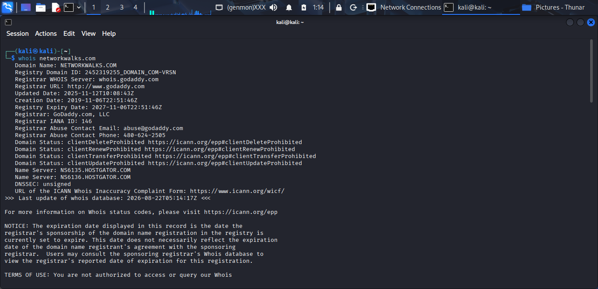
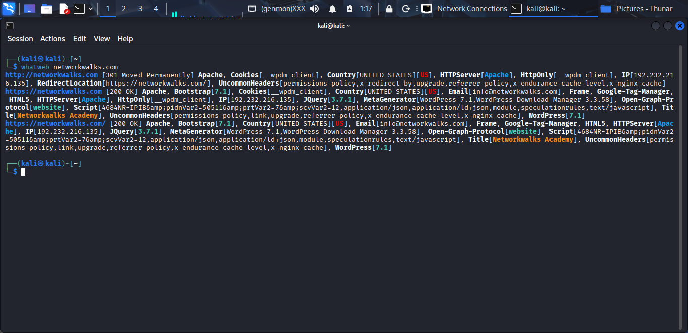
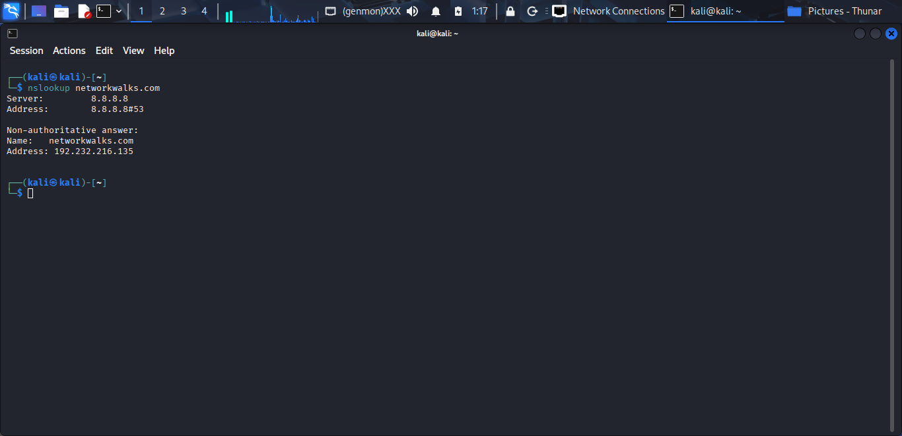
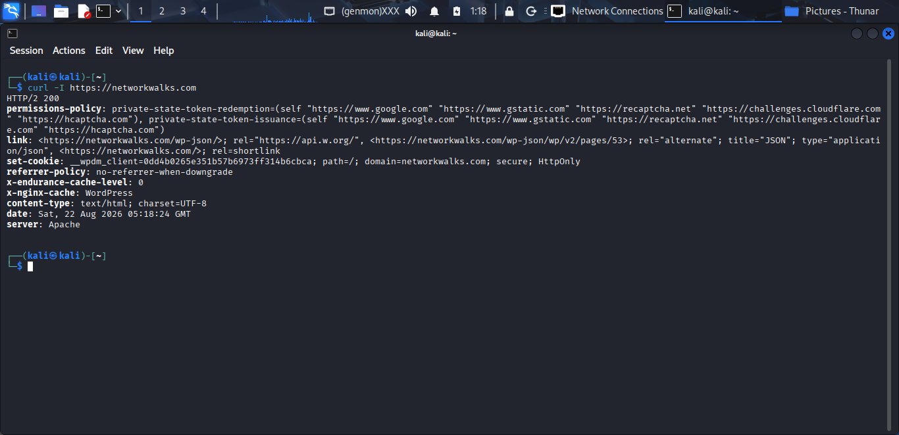
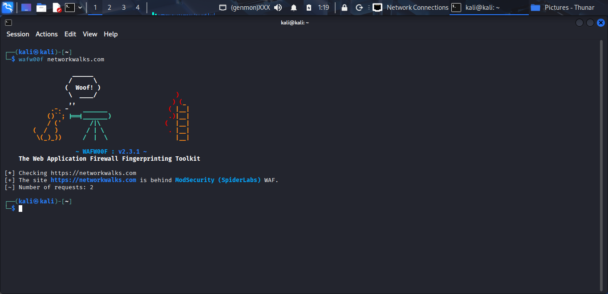
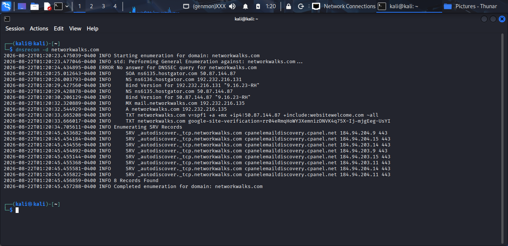
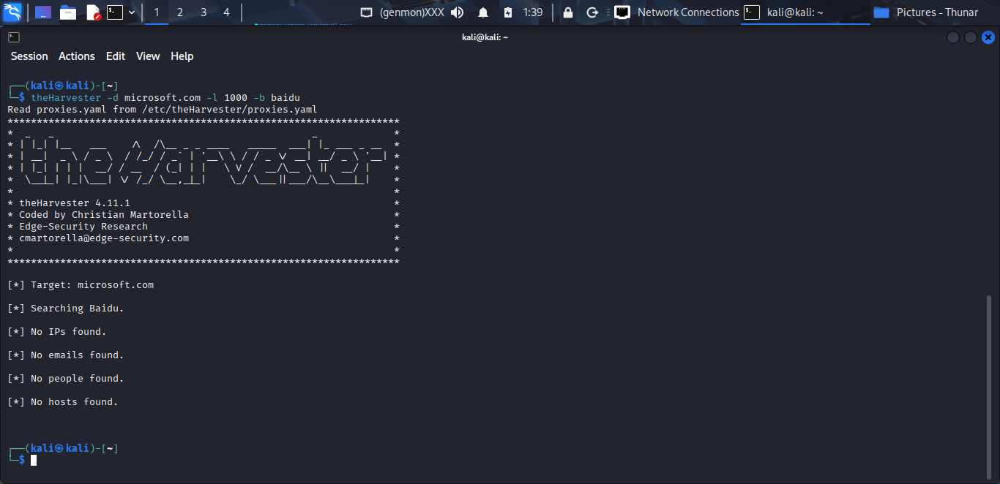
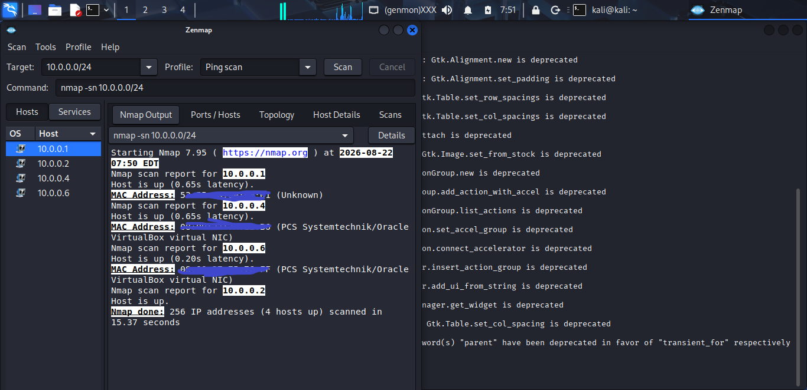

This repository contains my completed Week 2 practical exercises for the Cybersecurity Internship Program at Networkwalks.

The project focuses on key stages of ethical hacking, including footprinting, reconnaissance, network scanning, and network discovery.

The following modules were completed:

* **W2-PM1:** Footprinting with Multiple Kali Tools
* **W2-PM2:** GHDB-Based Footprinting
* **W2-PM3:** Maltego-Based Footprinting
* **W2-PM4:** theHarvester Footprinting
* **W2-PM5:** Zenmap Network Scanning

All practical activities were conducted within authorized testing environments, including permitted targets and my own local network.

📄 Penetration Testing Report
The complete penetration testing report is available below:

[📄 Download Report](Joseph_Victor_Networkwalks_Week2_Report.docx)

View / Download Full Report

1. ## Liability Disclaimer

All activities documented in this report were conducted strictly for educational, research, and cybersecurity training purposes. Testing was performed only on systems, networks, and targets that were authorized for assessment or were personally owned and controlled by me.

The techniques and tools discussed in this report are intended to demonstrate how reconnaissance, footprinting, scanning, and network discovery are performed so that security professionals can better understand and defend information systems.

No unauthorized access, exploitation, or malicious activity was intended or performed. The information presented must not be used to access, test, disrupt, or compromise systems without proper authorization.

I acknowledge that unauthorized security testing may violate applicable laws and regulations. I accept responsibility for ensuring that any future security testing I conduct is performed within a clearly defined and legally authorized scope.

This report is prepared solely as evidence of my practical learning and experience during the Networkwalks Cybersecurity and Ethical Hacking Internship.

2. ## Introduction

Week 2 of the Networkwalks Cybersecurity and Ethical Hacking Internship focused on the early stages of the penetration testing process, particularly footprinting and reconnaissance.

During this phase, I carried out practical exercises using a range of cybersecurity tools to gather information about authorized targets and analyze network environments.

The following modules were completed:
## W2-PM1:## Footprinting with Multiple Kali Tools(whois, whatweb, nslookup, curl, wafw00f, dnsrecon) on networkwalks.com
## W2-PM2:## GHDB-Based Footprinting
## W2-PM3:## Maltego-Based Footprinting on networkwalks.com
## W2-PM4:## theHarvester Footprinting on microsoft.com
## W2-PM5:## Zenmap Network Scanning on my local network

3. ## Tools Used
Tool	Purpose
Kali Linux & Windows	Operating systems used for reconnaissance activities
WHOIS	Find domain registration details (owner, dates, name servers).
WhatWeb	Fingerprint web technologies (server, CMS, plugins, IP).
nslookup	Resolve the domain name to its IP address using DNS.
curl -I	Read the HTTP response headers of the website.
wafw00f	Detect whether a Web Application Firewall protects the site.
dnsrecon	Enumerate all DNS records (NS, MX, SPF, TXT, SRV).
GHDB (Google Hacking Database)	Perform targeted searches using advanced search operators to identify publicly exposed information and resources.
Maltego	Visual OSINT gathering.
theHarvester	Collect emails, subdomains, and hosts.
Zenmap (Nmap GUI)	Scan the local subnet to find live hosts, IPs, and MAC addresses.

4. ## Activities Performed
4.1 ## Footprinting and Reconnaissance
4.1.1 WHOIS 
Achievement: Gathered domain registration information, including registrar details, registration dates, and name servers.

## 4.1.2 WhatWeb
Achievement: Identified the web server, technologies, frameworks, CMS, and other publicly detectable components used by the website.
## Findings
Web server: Apache
CMS: Wordpress 7.1
Plugin: WordPress Download Manager 3.3.58
Server IP: 192.232.216.135
Client-side library technology& version: JQuery[3.7.1]
email: info@networkwalks.com

## 4.1.3 nslookup
Achievement: resolved the domain name to its IP address. 

## 4.1.4 curl -I
Achievement: read the http response of the website networkwalks.com

findings
1. Wordpress REST API is publicly discoverable in link: <https://networkwalks.com/wp-json/>; rel="https://api.w.org/"
2. cookie has only **httponly** flag which means javascript cannot directly access cookie
3. Website uses some security headers like **Permission policy and Referrer policy**

## 4.1.5 wafw00f 
Achievement: Detect the Web Application Firewall(WAF) name for the website

## 4.1.6 dnsrecon
Findings:
1.Name server is hostgator
2.cpanel is exposed 
3.Web and mail appear to share an IP
4. identified a SPF policy which authorised some email-sending sources but uses ~all SoftFail mechanism for authorised sources.

## 4.2 GHDB-Based Footprinting
Achievement: understood how the Google Hacking Database (GHDB) and advanced Google search operators can be used during reconnaissance to identify publicly indexed information and resources.

The exercise focused on two areas:
+Identifying publicly indexed security-camera interfaces.
+Identifying publicly accessible mathematics PDF resources.

No exploitation or unauthorized access was performed.

## Task 1 — Security Camera Footprinting
GHDB search operators were used to identify publicly indexed camera interfaces based on distinctive titles, URL patterns, and known camera software.

Findings
The searches identified multiple results associated with WebCamXP, VB Viewer, and network-camera interfaces.
For ethical and responsible-disclosure reasons, specific IP addresses, live camera URLs, credentials, and other sensitive target information have been redacted from this public report.

No.	Finding	Relevant Dork	Sensitive Details
1	WebCamXP interface	intitle:"webcamXP" inurl:8080	Redacted
2	WebCamXP interface	intitle:"WebcamXP"	Redacted
3	VB Viewer interface	inurl:/viewer/live/ja/live.html	Redacted
4	VB Viewer interface	inurl:/viewer/live/ja/live.html	Redacted
5	WebCamXP 5 interface	intitle:"WebCamXP 5"	Redacted
6	WebCamXP 5 interface	intitle:"WebCamXP 5"	Redacted
7	WebCamXP 5 interface	intitle:"WebCamXP 5"	Redacted
8	WebCamXP 5 interface	intitle:"WebCamXP 5"	Redacted
9	Network camera interface	inurl:/view.shtml	Redacted
10	Network camera interface	inurl:"view.shtml" "Network Camera"	Redacted

## Task 2 — Mathematics PDF Footprinting
The second activity demonstrated how search operators can locate publicly accessible educational documents.

| No. | Link | Relevant Dork | Username /Password (if any) |
|---:|---|---|---|
| **1** | [https://ncm.gu.se/wp-content/uploads/2020/06/10_34_043064_johansson.pdf](https://ncm.gu.se/wp-content/uploads/2020/06/10_34_043064_johansson.pdf) | `filetype\:pdf intitle:"Mathematics textbook"` | **---** |
| **2** | [**https://www.vaccination.gov.ng/browse/bRsAya/275032/N3_Mathematics__Textbook.pdf**](https://www.vaccination.gov.ng/browse/bRsAya/275032/N3_Mathematics__Textbook.pdf) | `filetype\:pdf intitle:"Mathematics textbook"` | **----** |
| **3** | [**https://www.siyavula.com/downloads/books/maths/Gr10_Mathematics_Learner_Eng_v11.pdf**](https://www.siyavula.com/downloads/books/maths/Gr10_Mathematics_Learner_Eng_v11.pdf) | `filetype\:pdf intitle:"Mathematics textbook"` | **----** |
| **4** | [**https://www.cambridge.org/gh/files/5716/0223/9119/Essential_Mathematics_Primary_3_Teachers_Guide_9789988897352AR.pdf**](https://www.cambridge.org/gh/files/5716/0223/9119/Essential_Mathematics_Primary_3_Teachers_Guide_9789988897352AR.pdf) | `filetype\:pdf intitle:"Mathematics textbook` | **---** |
| **5** | [**https://discrete.openmathbooks.org/pdfs/dmoi4.pdf**](https://discrete.openmathbooks.org/pdfs/dmoi4.pdf) | `filetype\:pdf intitle:"Mathematics textbook` | **----** |
| **6** | [**http://www.uop.edu.pk/ocontents/AdvancedEngineeringMathematics.pdf**](http://www.uop.edu.pk/ocontents/AdvancedEngineeringMathematics.pdf) | `filetype\:pdf intitle:"Mathematics textbook` | **----** |
| **--7** | [**https://fresh-teacher.github.io/p5/P_5-PRIMARY-FIVE-MATHEMATICS-NOTES%20TERM%201%20-3.pdf**](https://fresh-teacher.github.io/p5/P_5-PRIMARY-FIVE-MATHEMATICS-NOTES%20TERM%201%20-3.pdf) | `filetype\:pdf intitle:"Mathematics textbook` | **----** |
| **8** | [**https://ia800705.us.archive.org/24/items/basic-mathematics-serge-lang_20240418/Basic%20Mathematics%20-%20Serge%20Lang.pdf**](https://ia800705.us.archive.org/24/items/basic-mathematics-serge-lang_20240418/Basic%20Mathematics%20-%20Serge%20Lang.pdf) | **site\:archive.org mathematics textbook filetype\:pdf** | **-----** |
| **9** | [**https://dn790001.ca.archive.org/0/items/unifiedmathemati00karpiala/unifiedmathemati00karpiala.pdf**](https://dn790001.ca.archive.org/0/items/unifiedmathemati00karpiala/unifiedmathemati00karpiala.pdf) | **site\:archive.org mathematics textbook filetype\:pdf** | **-----** |
| **10** | [**https://cis.temple.edu/\~latecki/Courses/CIS2166-Fall25/RosenDiscreteMath8Ed.pdf**](https://cis.temple.edu/~latecki/Courses/CIS2166-Fall25/RosenDiscreteMath8Ed.pdf) | **site\:edu filetype\:pdf mathematics textbook** | **-----** |

Findings
The searches returned publicly accessible mathematics textbooks, lecture materials, teachers' guides, and other educational PDFs.
Unlike the camera exercise, these resources were treated as public educational content rather than security vulnerabilities.

## 4.3 Maltego Footprinting
I used Maltego CE to investigate whether any email addresses connected to networkwalks.com could be identified through publicly available sources.

Approach
1. Downloaded Maltego to windows
2. Created a new investigation graph.
3. Added networkwalks.com as the starting Domain entity.
4. Selected the Email Address transform.
5. Executed the available transforms and reviewed the resulting entities.

Result
The investigation returned only one email address associated with networkwalks.com

## 4.4 theHarvester footprinting
TheHarvester was used to gather publicly available information associated with an authorized target domain[microsoft.com]. The focus was on identifying the email addresses, subdomains, and hosts from publicly available sources.

Setup
+ Launched Kali Linux.
+ Opened a terminal and verified that theHarvester was available.
+ Selected the target domain [microsoft.com] used for the authorized lab.
+ Performed searches using baidu first and then from all available data sources.
+ Recorded the results for analysis and documentation.

Findings
**Baidu**
| Category        | Finding |
| --------------- | ------: |
| IP Addresses    |       0 |
| Email Addresses |       0 |
| People          |       0 |
| Hosts           |       0 |

**all data sources**
| Category         |    Finding |
| ---------------- | ---------: |
| ASNs             |          8 |
| Interesting URLs |          2 |
| LinkedIn         | No results |
| IP Addresses     |        122 |
| Email Addresses  |          3 |
| Hosts            |      9,968 |

## 4.5 Zenmap
Zenmap was used from Kali Linux to perform a ping scan of the authorized lab network. The purpose was to identify active devices within the specially configured NAT Network.

Scan Setup
Tool: Zenmap (Nmap GUI)
Operating System: Kali Linux
Scan Type: Ping Scan
Target: 10.0.0.0/24
Network: NAT Network[Networklab]

The scan identified 4 live hosts on the network:

IP Address	Identified Device	
10.0.0.1	Network Gateway	
10.0.0.2	Kali Linux	
10.0.0.4	Windows 8
10.0.0.6	Windows 10	

Zenmap also displayed two distinct MAC addresses and identified device/vendor names where available.

## 5. Risk and Findings
|     # | Risk / Finding                             | Evidence / Observation                                                                         | Potential Impact                                                                           |        Risk       |
| ----: | ------------------------------------------ | ---------------------------------------------------------------------------------------------- | ------------------------------------------------------------------------------------------ | :---------------: |
| **1** | **Web technology information exposed**     | WhatWeb identified Apache, WordPress 7.1, WordPress Download Manager 3.3.58, and jQuery 3.7.1. | Helps attackers identify technologies and potential weaknesses for further reconnaissance. |   🟠 **Medium**   |
| **2** | **Server IP address identifiable**         | `nslookup` resolved `networkwalks.com` to `192.232.216.135`.                                   | Reveals the web server's network location and contributes to the infrastructure footprint. |     🟢 **Low**    |
| **3** | **HTTP and API information exposed**       | `curl -I` revealed HTTP headers and the WordPress REST API endpoint `/wp-json/`.               | Supports technology fingerprinting and further website enumeration.                        |     🟢 **Low**    |
| **4** | **WAF technology identifiable**            | `wafw00f` identified ModSecurity (SpiderLabs).                                                 | Reveals information about the defensive technology protecting the application.             |     🟢 **Low**    |
| **5** | **DNS infrastructure information exposed** | `dnsrecon` identified nameserver, mail, SPF, and other DNS records.                            | Can be combined with other information to map the organization's infrastructure.           |   🟠 **Medium**   |
| **6** | **cPanel publicly identifiable**           | DNS reconnaissance indicated that cPanel was exposed/discoverable.                             | Increases the visible attack surface and may attract credential-based attacks.             |   🟠 **Medium**   |
| **7** | **SPF SoftFail configuration**             | DNS enumeration identified an SPF policy using the `~all` SoftFail mechanism.                  | Provides weaker email-spoofing protection than a stricter SPF policy.                      | 🟡 **Low–Medium** |
| **8** | **Multiple live hosts on the lab network** | Zenmap identified four live hosts on the authorized `10.0.0.0/24` NAT network.                 | Demonstrates how quickly active devices can be discovered and mapped.                      |     🟢 **Low**    |

Observation: The footprinting activities showed that Networkwalks exposes several pieces of information through its web application and DNS infrastructure, while the Zenmap exercise demonstrated how quickly active devices can be identified within a local network. These findings represent reconnaissance observations rather than confirmed vulnerabilities, since no exploitation or vulnerability validation was performed.

## 6. Recommendations
|  **#** | **Recommendation**                                                                        | **Purpose**                                                                                        |
| -----: | ----------------------------------------------------------------------------------------- | -------------------------------------------------------------------------------------------------- |
|  **1** | **Keep WordPress, plugins, and client-side libraries regularly updated.**                 | Reduces exposure to known vulnerabilities in outdated software components.                         |
|  **2** | **Review publicly exposed web-server and technology information.**                        | Minimizes unnecessary information disclosure that could assist technology fingerprinting.          |
|  **3** | **Review the public availability of the WordPress REST API.**                             | Ensure that only information intended for public access is exposed through the API.                |
|  **4** | **Restrict access to cPanel where possible.**                                             | Reduces exposure of the administrative interface to unauthorized users and automated attacks.      |
|  **5** | **Review DNS records and remove unnecessary publicly exposed records.**                   | Reduces the amount of infrastructure information available during reconnaissance.                  |
|  **6** | **Review and strengthen the SPF configuration.**                                          | Helps improve protection against email spoofing and impersonation.                                 |
|  **7** | **Continue using appropriate security headers and review their configuration regularly.** | Helps strengthen browser-side security and reduce unnecessary information exposure.                |
|  **8** | **Maintain an inventory of devices on the internal network.**                             | Ensures that all discovered hosts are known, authorized, and properly secured.                     |
|  **9** | **Segment sensitive systems and administrative services from general network access.**    | Limits what an attacker can discover or reach if one device on the network is compromised.         |
| **10** | **Perform periodic external footprinting and internal network discovery.**                | Helps identify newly exposed services, infrastructure, and devices before attackers discover them. |

## 7. Conclusion
Week 2 gave me a more practical understanding of what happens before an actual attack begins. Instead of focusing on exploitation, I learned how much information can already be discovered through simple footprinting and reconnaissance techniques.

Using tools such as WHOIS, WhatWeb, nslookup, cURL, WAFW00F, DNSRecon, GHDB, Maltego, theHarvester, and Zenmap, I was able to examine different parts of a target's digital footprint. I also saw how information such as technologies, DNS records, server details, and active network hosts can gradually build a clearer picture of an environment.

One of the biggest lessons for me was that information that appears harmless on its own can become valuable when combined with other findings. This made me understand why reconnaissance is such an important stage of penetration testing and why organizations need to know what they expose publicly.

The Zenmap exercise also helped me connect the concepts to a real lab environment by identifying live systems on my isolated network.

Overall, this week was all about learning the stage that one must go through before an exploitation/attack can be carried out efficiently,effectively, and successfully.

## 8. Evidences collected
### WHOIS

### WhatWeb

### NSLookup

### cURL

### WAFW00F

### DNSRecon

## Maltego
.png)
.png)

## Harvester

.png)
.png)
.png)
.png)

 ## Zenmap

.png)